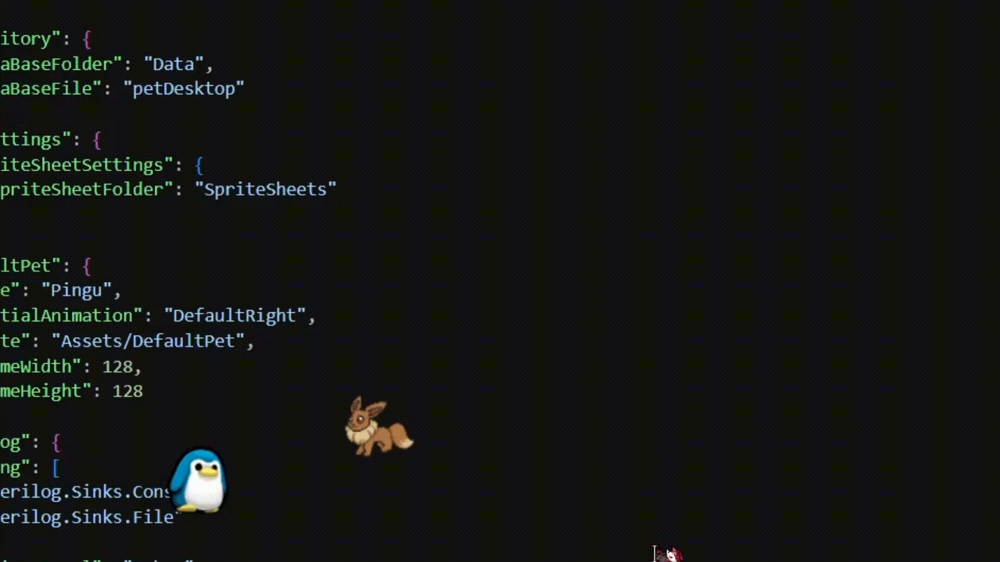

# 🐾 PetDesktop

> **Bring your desktop to life!** 🚀

### **PetDesktop** is a lightweight, fully customizable virtual companion designed to wander around your screen while you work, study, or game.

Built from the ground up with **Avalonia UI (.NET 10)**, it combines nostalgic pixel-art charm with modern desktop performance. Whether you want a quiet buddy hanging out on top of your windows, a playful pet bouncing off your screen edges, or a horde of custom pets roaming your workspace, **PetDesktop** brings immediate personality to your desktop environment.

<div align="center">

</div>

---

## 🎨 Adding Custom Pets

You can add your own pets if you have directional sprite sheets or individual frames for **Right**, **Left**, **Up (Backwards)**, and **Down (Forwards)** animations.

> **Note on Sprite Proportions:**
> Sprites should follow consistent frame dimensions (e.g., $24\times24\text{ px}$, $32\times32\text{ px}$, or $64\times64\text{ px}$). Regardless of the source frame size, the current rendered pet size on screen is normalized to **$64\times64\text{ px}$**.

### Step-by-Step Guide:

1. **Prepare Sprites:** If you have a single sprite sheet, split it into individual frames using tools like [Ezgif Sprite Cutter](https://ezgif.com/sprite-cutter?utm_source=gemini).
2. **Directory Setup:**
* Open the build folder (e.g., `PetDesktop-winx64`).
* Navigate to `Assets/`.
* Create a new folder for your pet (e.g., `Assets/MyCustomPet/`).


3. **Subfolder Creation:** Inside your new pet directory, create **4 exact subfolders**:
* `WalkRight`
* `WalkLeft`
* `WalkBackwards`
* `WalkForwards`


4. **Add Assets:** Place the corresponding frame images inside their respective subfolders.
5. **Update `appsettings.json`:**
   Configure your custom pet settings:
```json
"DefaultPet": {
  "Name": "MyCustomPet",
  "InitialAnimation": "DefaultRight",
  "Route": "Assets/MyCustomPet",
  "FrameWidth": 64,
  "FrameHeight": 64
}

```


*(Set `FrameWidth` and `FrameHeight` to match the source file dimensions).*
6. **Run the Application:** Upon startup, PetDesktop will automatically construct the required sprite sheets and persist the new pet data to the database.

---

## 💡 Tips & Multi-Instance Usage

* **Multiple Instances:** You can launch multiple instances of `PetDesktop.exe` simultaneously to spawn multiple pets. Be mindful of system resource usage.
* **Different Pets Simultaneously:** To run different pets at the same time, open one instance, update `appsettings.json` to a different pet configuration, and launch a second instance.
* **Screen Boundary Awareness:** Each pet instance monitors the primary display/window bounds where it was launched.

---

## ⚙️ Default Pet Configuration (`appsettings.json`)

You can switch between default pets by updating the `DefaultPet` section in your `appsettings.json` file:

### 🦊 Eevee
```json
"DefaultPet": {
  "Name": "Eevee",
  "InitialAnimation": "DefaultRight",
  "Route": "Assets/EeveeDefault",
  "FrameWidth": 64,
  "FrameHeight": 64
}
```
###  🐧 Pingu
```json
"DefaultPet": {
  "Name": "Pingu",
  "InitialAnimation": "DefaultRight",
  "Route": "Assets/DefaultPet",
  "FrameWidth": 128,
  "FrameHeight": 128
}
```

---

## ✨ Key Features

* **Configurable Pets:** Easily switch between predefined pets like **Eevee** and **Pingu**, or register custom pets via `appsettings.json`.
* **Autonomous Movement:** Features screen edge collision detection and real-time movement/idle behaviors.
* **Interactive Floating Window:** Transparent, Always-on-Top desktop window with full drag-and-drop support.
* **Optimized Rendering:** Smooth sprite rendering using Avalonia's native `CroppedBitmap` to minimize memory usage and Garbage Collector (GC) overhead.
* **Standalone Binary:** Supports self-contained executable builds — no pre-installed .NET runtime required.

---

## 🛠️ Architecture & Technologies

PetDesktop follows a clean, decoupled architecture separating UI logic from domain models:

* **UI Framework:** Avalonia UI (C# / XAML)
* **Design Pattern:** MVVM (Model-View-ViewModel) using `CommunityToolkit.Mvvm`
* **Persistence & Storage:** SQLite with Entity Framework Core
* **Logging:** Serilog (Console and File logging)
* **Asset Pipeline:** Native SkiaSharp pipeline for automated SpriteSheet generation

---

## 🚀 Roadmap & Future Improvements

- [ ] Graphical User Interface (GUI) for creating and managing custom pets dynamically.
- [ ] Configurable pet rendered display sizes via settings.
- [ ] Application icon overhaul (design and assign a proper high-res executable icon).
- [ ] General bug fixes and performance polish.

---

## 🎨 Credits & Asset Attributions

The sprite assets and icons used in this project belong to their respective creators:

* **Pingu Assets:** Derived from the [Penguin Skin Sprite Sheet](https://spelunky.fyi/mods/m/penguin-skin-sprite-sheet/?utm_source=gemini) on Spelunky.fyi.
* **Eevee Walk Assets:** Derived from [Eevee Walk Sprite (F2U)](https://www.deviantart.com/starwolff-nyota/art/Eevee-Walk-Sprite-F2U-1112113629?utm_source=gemini) created by Starwolff-Nyota on DeviantArt.
* **Eevee Icon:** Derived from [Eevee Pixel Art Icon](https://dinopixel.com/eevee-pixel-art-pixel-art-13697?utm_source=gemini) on DinoPixel.

> **Disclaimer:** All assets are used for non-commercial, educational, and open-source demonstration purposes. If you are a creator and wish to update attribution or request removal, please open an Issue or reach out directly.

---
## 📜 License

This project is released under the **MIT License** — see the [LICENSE](LICENSE) file for details.

> **Disclaimer:** The MIT License applies strictly to the source code of this application. All sprite assets, pixel art, characters, and trademarks belong to their respective owners and are used solely for non-commercial, educational demonstration purposes.